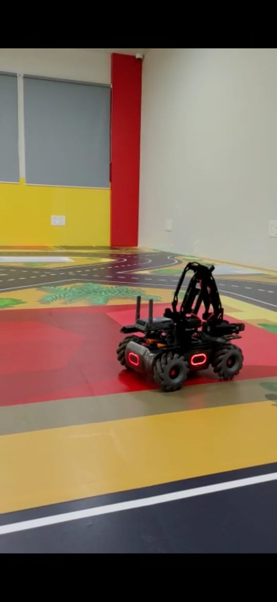

# MobileRobot-Openloopcontrol
## Aim:

To develop a python control code to move the mobilerobot along the predefined path.

## Equipments Required:
1. RoboMaster EP core
2. Python 3.7

## Procedure

# Step1: 
Use from robomaster import robot.

# Step2: 
Choose the x,y,z - axis movement distance(meters).

# Step3: 
Give ep_chassis.move to move straight.

# Step4: 
Give time.sleep() for a break.

# Step5: 
Give ep_chassis.drive_speed to have a circular movement.

## Program
```python
from robomaster import robot
import time

if __name__ == '__main__':
    ep_robot = robot.Robot()
    ep_robot.initialize(conn_type="ap")

    ep_chassis = ep_robot.chassis

    ## Write your code here
##Developed by: VISMAYA.S
##Register number:212221230125

from robomaster import robot
import time

if _name_ == '_main_':
    ep_robot = robot.Robot()
    ep_robot.initialize(conn_type="ap")

    ep_chassis = ep_robot.chassis

    ep_chassis.move(x=2, y=0, z=0, xy_speed=14).wait_for_completed()

    ep_chassis.move(x=0, y=0, z=90, xy_speed=4).wait_for_completed()

    ep_chassis.move(x=2, y=0, z=0, xy_speed=4).wait_for_completed()

    ep_chassis.move(x=0, y=0, z=90, xy_speed=4).wait_for_completed()

    ep_chassis.move(x=2, y=0, z=0, xy_speed=4).wait_for_completed()

    ep_chassis.move(x=0, y=0, z=90, xy_speed=4).wait_for_completed()

    ep_chassis.move(x=2, y=0, z=0, xy_speed=4).wait_for_completed()

    ep_chassis.move(x=0, y=0, z=90, xy_speed=4).wait_for_completed()

   

    ep_robot.close()


    
    ep_robot.close()
```

## MobileRobot Movement Image:


Insert image here


<br/>
<br/>
<br/>
<br/>

## MobileRobot Movement Video:

Upload your video in Youtube and paste your video-id here

https://youtube.com/shorts/P3YG3rxl1Zw?feature=share
<br/>
<br/>
<br/>
<br/>

## Result:
Thus the python program code is developed to move the mobilerobot in the predefined path.


<br/>
<br/>

```
Mobile Robotics Laboratory
Department of Artificial Intelligence and Data Science/ Machine Learning
Saveetha Engineering College
```
